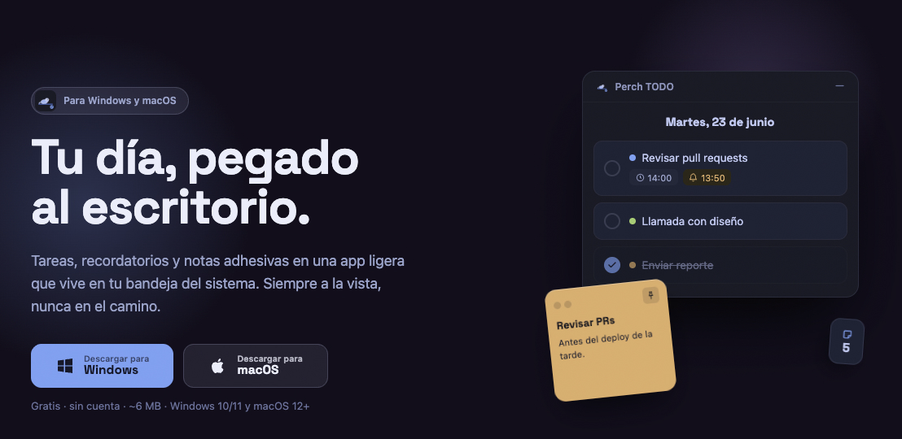
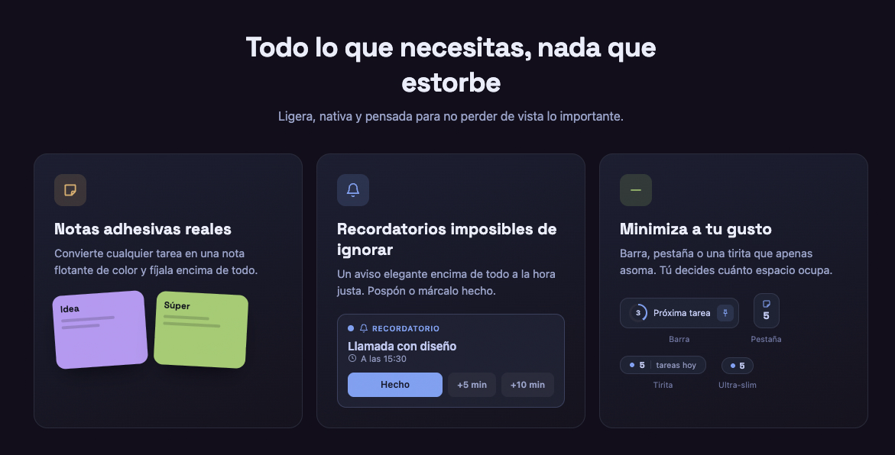
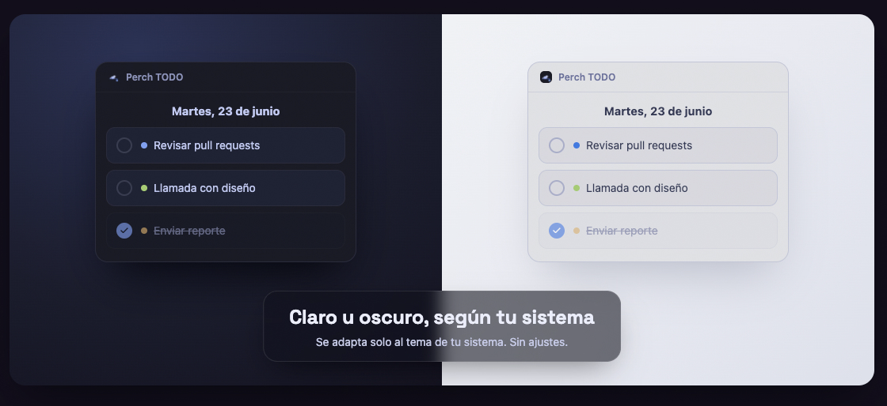
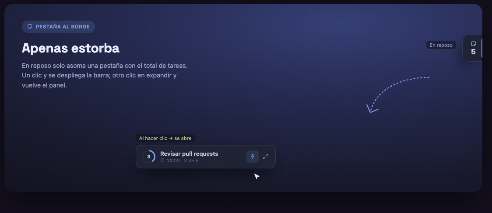
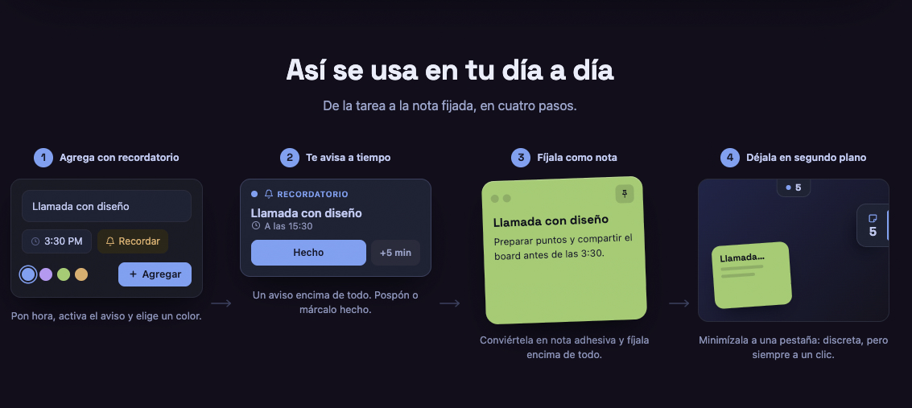
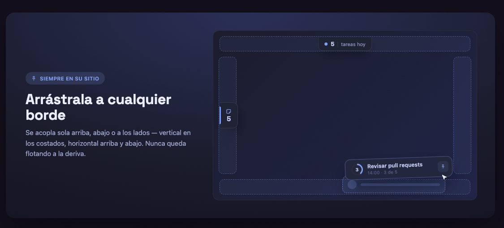

<div align="center">
  
  <h1>Perch TODO</h1>
  <p><strong>Tu día, pegado al escritorio.</strong></p>
  <p>Tareas, recordatorios y notas adhesivas en una app ligera que vive en tu bandeja del sistema.<br>Siempre a la vista, nunca en el camino.</p>

  [](https://github.com/Aaronjc1235/Perch-TODO/releases/latest)
  [](https://github.com/Aaronjc1235/Perch-TODO/releases/download/v0.1.2/Perch.TODO_0.1.0_x64-setup.exe)
  [](https://github.com/Aaronjc1235/Perch-TODO/releases/download/v0.1.2/Perch.TODO_0.1.0_aarch64.dmg)
  [](https://github.com/Aaronjc1235/Perch-TODO/releases/latest)

</div>

---



---

## Descarga

| Plataforma | Instalador |
|---|---|
| **Windows 10 / 11** | [Descargar `.exe`](https://github.com/Aaronjc1235/Perch-TODO/releases/download/v0.1.2/Perch.TODO_0.1.0_x64-setup.exe) |
| **macOS 12+ (Apple Silicon)** | [Descargar `.dmg`](https://github.com/Aaronjc1235/Perch-TODO/releases/download/v0.1.2/Perch.TODO_0.1.0_aarch64.dmg) |

Gratis · sin cuenta · ~6 MB · se instala en segundos.

---

## Funciones

### Notas adhesivas reales



Convierte cualquier tarea en una nota flotante de color y fíjala encima de todo lo demás. Perfecta para lo que no puedes olvidar en el momento.

---

### Recordatorios que no se pierden



Pon hora, activa el aviso y elige un color. Perch te avisa encima de todo con un banner persistente: pospón o márcalo hecho sin abrir el panel.

---

### Tan presente o discreta como la necesites



Tres niveles de minimizado: **Barra** muestra tu próxima tarea + botón de fijar, **Pestaña** solo el contador y **Tirita** apenas asoma. Con un toque la fijas encima de todo para no perderla de vista.

---

### Modo oscuro y claro



Sigue automáticamente el tema del sistema. Cambia en tiempo real sin reiniciar.

---

## Cómo se usa



1. **Agrega con recordatorio** — Pon hora, activa el aviso y elige un color.
2. **Te avisa a tiempo** — Un aviso encima de todo. Pospón o márcalo hecho.
3. **Fíjala como nota** — Conviértela en nota adhesiva y fíjala encima de todo.
4. **Déjala en segundo plano** — Minimízala a pestaña: discreta, pero siempre a un clic.

---

## Siempre en su sitio


Se acopla sola arriba, abajo o a los lados — vertical en los costados, horizontal arriba y abajo. Nunca queda flotando a la deriva.

---

## Tecnología

Construida con [Tauri 2](https://tauri.app) + React + TypeScript. Base de datos local SQLite vía `tauri-plugin-sql`. Sin servidores, sin telemetría, sin cuentas.

- **Peso:** ~6 MB (incluye WebView2 offline en Windows)
- **Arranque automático:** se registra al primer lanzamiento, inicia minimizado sin flash
- **Instancia única:** un solo proceso, siempre en la bandeja del sistema

---

## Desarrollo local

```bash
# Requisitos: Node 20+, Rust stable, Tauri CLI
npm install
npm run tauri dev
```

### Build de producción

```bash
# Windows (.exe NSIS)
npm run tauri build -- --config src-tauri/tauri.microsoftstore.conf.json

# macOS (.dmg)
npm run tauri build -- --config src-tauri/tauri.macstore.conf.json --target aarch64-apple-darwin
```

Los releases se generan automáticamente vía GitHub Actions al crear un tag `v*`.

---

<div align="center">
  <sub>Hecho con paciencia y Tokyo Night. Gratis para siempre.</sub>
</div>
